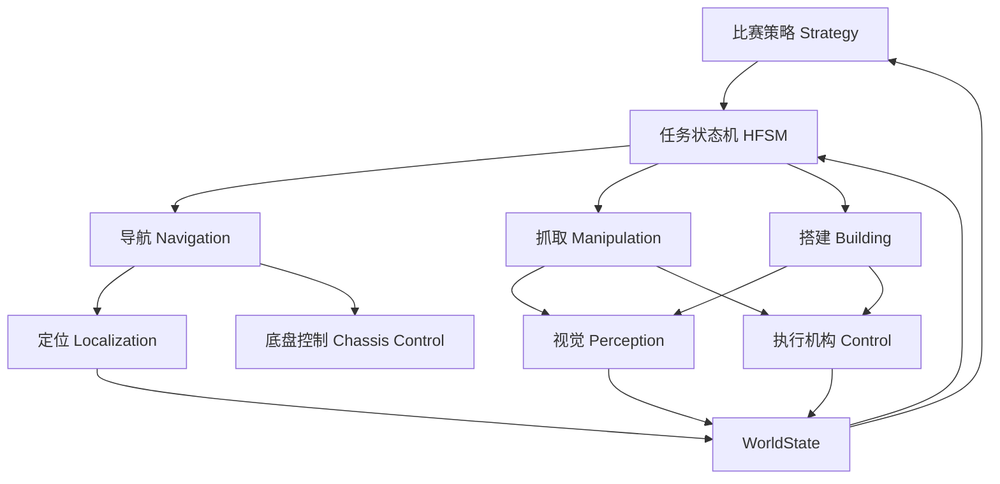
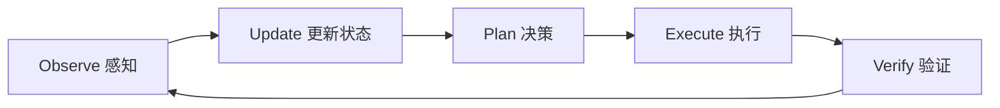
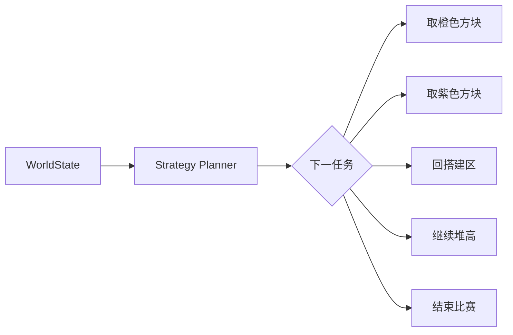
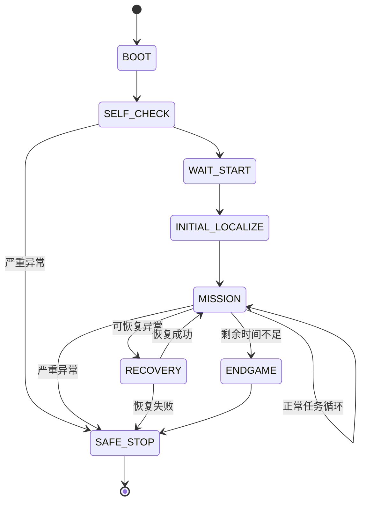
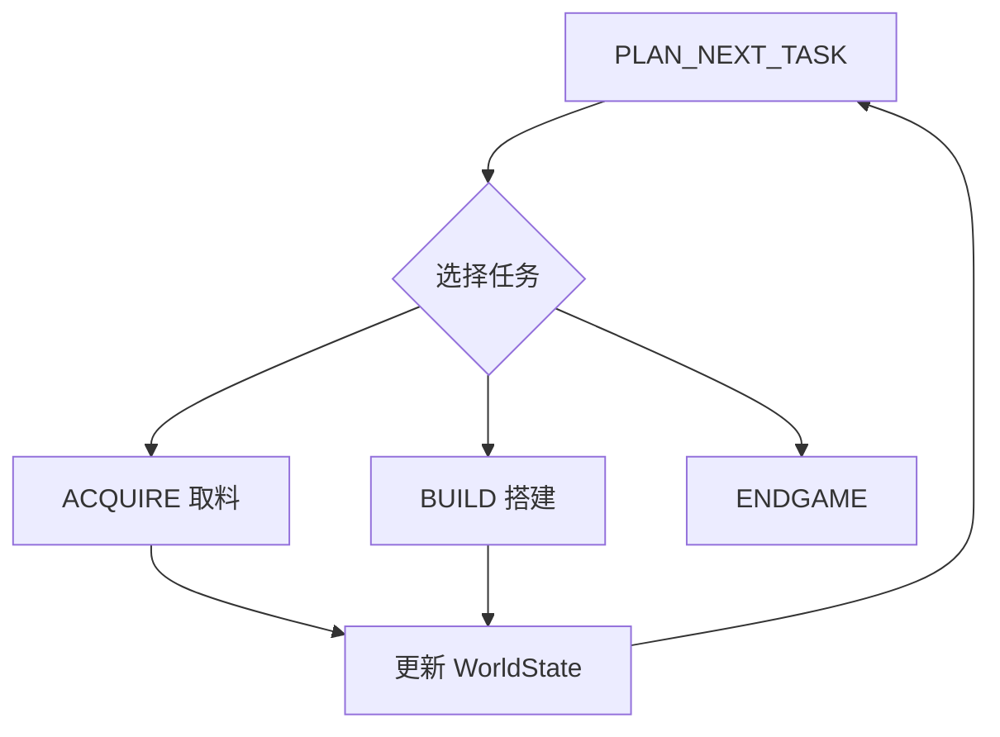
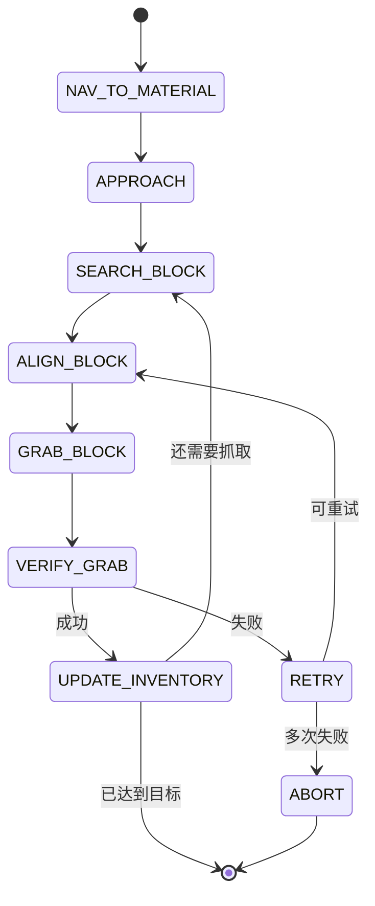
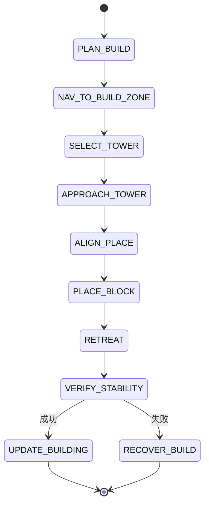
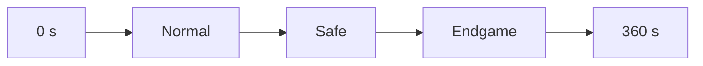
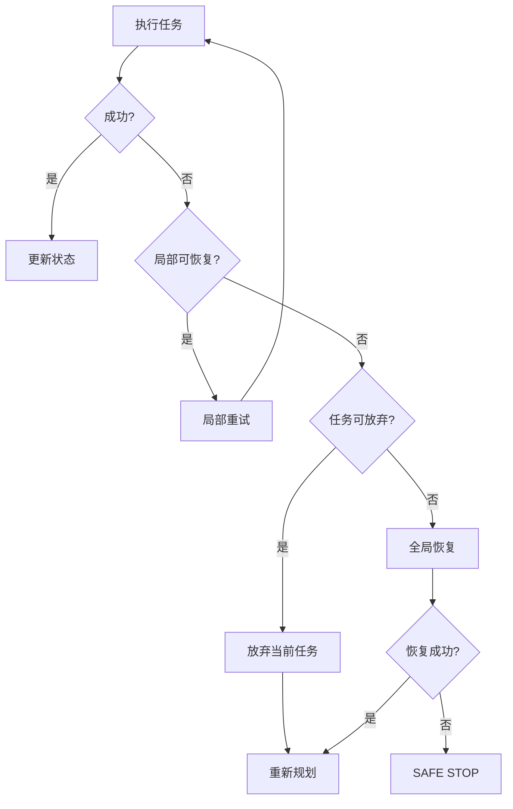

# RoboGame 2026 竞技组算法总体设计

> 目标：先设计清楚整台机器人的"思考逻辑"，再逐个实现视觉、定位、运动、抓取、搭建等模块。
> 核心原则：**先跑通完整闭环，再逐步提高智能程度。**

---

## 1. 项目需求

机器人需在 **6 分钟内全自动完成**以下流程：

```text
启动 → 定位 → 前往材料区 → 识别方块 → 对准 → 抓取
→ 运输 → 前往搭建区 → 对准 → 放置/搭建 → 判断结果 → 继续下一轮
```

规则关键约束：

- 比赛开始后机器人必须完全自主运行。
- 一次最多携带 3 个方块，其中紫色屋顶块最多 1 个。
- 抓取方块、放入搭建区均可获得基础得分。
- 建筑越高，得分越高。
- 紫色方块位于最顶层时，建筑得分 ×1.5。
- 建筑脱离机器人接触后需稳定至少 3 秒才计分。
- 最终只统计得分最高的 3 座建筑。
- 场地提供巡线与视觉标签，可用于导航、定位和姿态校正。

因此，算法系统的目标不是"完成某一个动作"，而是：

> **持续感知当前状态，选择下一项最合适的任务，并可靠执行。**

---

## 2. 整体架构

系统采用 **分层状态机 HFSM（Hierarchical Finite State Machine）**：高层决定"做什么"，低层决定"怎么做"。



机器人反复执行同一闭环：



一句话概括：

> **看清现状 → 决定下一步 → 执行 → 验证结果 → 重新决策。**

---

## 3. 三个核心组件

### 3.1 WorldState：机器人对世界的认知

WorldState 统一记录当前状态：

```text
WorldState
├── Robot
│   ├── x, y, yaw
│   ├── velocity
│   └── localization_confidence
│
├── Match
│   ├── elapsed_time
│   ├── remaining_time
│   └── current_score
│
├── Inventory
│   ├── orange_count
│   └── purple_count
│
├── Material
│   ├── orange_available
│   └── purple_available
│
├── Building
│   ├── tower_A
│   ├── tower_B
│   └── tower_C
│
└── System
    ├── vision_ok
    ├── localization_ok
    ├── chassis_ok
    └── manipulator_ok
```

**原则：所有模块只读取或更新 WorldState，模块之间不直接互相调用。**

### 3.2 Planner：决定下一步做什么

Planner 输入 WorldState，输出下一项任务：



第一版采用 **规则决策 + Utility 价值函数**，不使用强化学习或复杂 AI。核心思想：

```text
任务价值 = 得分收益 - 时间成本 - 风险
```

机器人每次选择价值最高的任务。

### 3.3 HFSM：负责把任务执行完

Planner 只下达任务，如"去拿 3 个橙色方块"；HFSM 负责真正完成：

```text
导航 → 搜索 → 对准 → 抓取 → 验证 → 再抓
```

> **Planner 是大脑，HFSM 是执行调度器。**

---

## 4. 顶层状态机



顶层只负责比赛生命周期：

1. 启动与自检。
2. 等待比赛开始。
3. 初始化定位。
4. 正常任务循环（MISSION）。
5. 异常恢复（RECOVERY）。
6. 终局处理（ENDGAME）与安全停止（SAFE_STOP）。

---

## 5. MISSION：正常任务循环



每完成一个任务都重新规划，不把整场比赛的路线一次性写死。

---

## 6. 取料逻辑（ACQUIRE）



设计要点：

- **导航负责到附近，视觉负责最后精确对准。**
- **抓取后必须验证。**
- **失败不能进入死循环。**

---

## 7. 搭建逻辑（BUILD）



搭建模块必须明确：

- 放在哪座塔、放第几层、是否现在放紫色屋顶。
- 放置后必须退开，并等待至少 3 秒确认稳定。
- 失败后更新状态，不得继续假设"已经成功"。

---

## 8. 三塔策略

最终只统计得分最高的 3 座建筑，因此内部直接维护三座塔：

| 塔 | 角色 |
| --- | --- |
| Tower A | 主塔，优先堆高 |
| Tower B | 稳定得分 |
| Tower C | 保底得分 |

Planner 不应只追求"最高"，而应比较预期收益：

```text
预期收益 = 得分 × 成功率
```

例如：

- **方案 A**：再堆一层——得分更高，但倒塌风险高。
- **方案 B**：建立第二座稳定塔——得分略低，但成功率高。

---

## 9. 时间策略

比赛总时间固定，不同阶段采用不同策略：



| 阶段 | 目标 | 要点 |
| --- | --- | --- |
| Normal | 最大化长期收益 | 允许多次往返、建高塔、获取紫色方块、尝试高收益动作 |
| Safe | 把已有资源转成稳定得分 | 减少高风险动作 |
| Endgame | 不再开始明显来不及完成的新任务 | 优先处理已携带的方块 |

具体时间阈值根据实机单次任务耗时测试确定。

---

## 10. 异常恢复

算法从第一版开始就必须设计失败路径：



三级恢复机制：

- **Level 1 局部恢复**：抓取失败 → 后退 → 重新识别 → 再抓一次。
- **Level 2 任务恢复**：连续两次抓取失败 → 放弃当前方块 → 换一个目标。
- **Level 3 全局恢复**：定位严重失效 → 停车 → 寻找视觉标签重定位 → 重新规划；仍失败则安全停止（SAFE_STOP）。

---

## 11. 动作统一返回值

所有动作（Skill）统一返回四种结果：

```text
RUNNING / SUCCESS / FAILURE / TIMEOUT
```

`navigate(goal)`、`grab(block)`、`place(tower)`、`align(target)` 等均使用同一结果格式，保证状态机不会因某个模块卡住而死锁。

---

## 12. 模块职责

| 模块 | 负责什么 | 不负责什么 |
| --- | --- | --- |
| Strategy Planner | 决定下一步做什么 | 不直接控制电机 |
| HFSM | 调度任务执行 | 不做视觉识别 |
| WorldState | 保存机器人当前认知 | 不主动做决策 |
| Perception | 识别黑线、Tag、方块 | 不决定去哪里 |
| Localization | 输出 `(x, y, yaw)` | 不做任务规划 |
| Navigation | 从 A 点到 B 点 | 不负责抓取 |
| Manipulation | 对准、抓取、释放 | 不负责全局路线 |
| Building Planner | 决定方块放哪里 | 不直接控制机械 |
| Chassis Control | 底盘速度和电机控制 | 不理解比赛策略 |

---

## 13. 模块接口

所有代码按统一接口开发：

```text
Localization
sensors
→ pose

Perception
image
→ objects

Navigation
goal
→ SUCCESS / FAILURE / TIMEOUT

Alignment
target
→ SUCCESS / FAILURE / TIMEOUT

Manipulator
command
→ SUCCESS / FAILURE / TIMEOUT

BuildingPlanner
WorldState
→ placement_target

StrategyPlanner
WorldState
→ next_task
```

统一接口的意义：后续更换算法时，无需重写整个系统。

---

## 14. 各模块实现方案与可行性

### 14.1 全局决策

- **第一版**：HFSM、规则决策 Planner、Utility 价值评分、比赛时间管理。
- **暂不做**：强化学习、MCTS、大模型决策。
- **可行性：高**——任务固定、状态空间小、规则明确，可解释且易调试。

### 14.2 定位

- **第一版**：固定起始位置、编码器里程计、IMU 修正姿态。
- **升级**：利用视觉标签校正累计漂移。
- **暂不做**：SLAM、复杂三维建图。
- **可行性：高**。

### 14.3 导航

- **第一版**：固定地图、固定 Waypoint、PID 路径跟踪。
- **升级**：Pure Pursuit、样条曲线路径。
- **暂不做**：A*、D*、动态路径规划——场地本身基本固定。
- **可行性：高**。

### 14.4 巡线

- **实现**：巡线传感器或摄像头检测黑线，计算横向误差，PID 修正底盘。
- **作用**：长距离路线约束，辅助导航。
- **可行性：很高**。

### 14.5 方块识别

- **第一版**：`RGB → HSV → 颜色分割 → 轮廓 → 方块中心`，识别橙色与紫色方块。
- **升级**：YOLO 或轻量检测网络；触发条件是经典视觉在真实比赛光照下不稳定。
- **可行性：很高**。

### 14.6 精确对准

- **方案**：Visual Servoing——检测目标 → 计算视觉误差 → 控制机器人微调 → 误差进入阈值 → 执行抓取/放置。
- **原则**：远距离导航与近距离对准必须分开。
- **可行性：高**。

### 14.7 抓取

- **实现**：视觉粗定位 → 视觉精对准 → 执行抓取 → 传感器验证。
- **验证方式**：限位开关、光电、电流、编码器、视觉辅助。
- **原则**：不允许"夹爪关了 = 抓取成功"。
- **可行性：高，但依赖机械设计**。

### 14.8 搭建

- **第一版**：预设 3 个搭建位置、固定层间高度、固定放置动作、放完退开并等待 3 秒。
- **升级**：视觉识别已有建筑、视觉修正放置位置、自动选择塔和层数。
- **主要风险**：累积定位误差、方块误差、高层稳定性、机械结构重复精度。
- **可行性**：低层搭建高；高层自动搭建中等，需大量实机测试。

---

## 15. 推荐实现顺序

不要同时开发所有模块，按以下顺序推进。

### Phase 1：完整闭环跑起来

- **实现**：HFSM 框架、WorldState、固定路线、基础底盘控制、固定抓取/放置动作。
- **目标**：即使没有复杂视觉，也能模拟完整比赛流程。

### Phase 2：让机器人走准

- **实现**：编码器、IMU、定位、Waypoint、巡线、PID / Pure Pursuit。
- **目标**：稳定地从 A 点到 B 点。

### Phase 3：让机器人看得懂

- **实现**：方块识别、视觉标签、Visual Servo、精确对准。
- **目标**：自动找到方块并对准。

### Phase 4：让抓取和搭建可靠

- **实现**：抓取与放置结果验证、三塔管理、搭建稳定性测试。
- **目标**：连续重复执行仍然可靠。

### Phase 5：增加策略能力

- **实现**：Utility Planner、Normal / Safe / Endgame 分段策略、在线任务选择、Recovery。
- **目标**：从"会完成任务"升级为"会比赛"。

---

## 16. 第一版技术路线

第一版系统尽量简单：

```text
HFSM
+ 固定 Waypoint
+ 编码器 / IMU
+ 巡线
+ HSV 方块识别
+ Visual Servo
+ PID
+ 固定三塔位置
```

**暂不引入**：强化学习、VLM、大模型、End-to-End 控制、SLAM、复杂深度视觉。

原因不是这些技术不能做，而是：

> **现阶段它们增加的工程风险大于收益。**

---

## 17. 团队开发基本原则

1. **先定义接口，再写实现。**
2. **Planner 不控制硬件。**
3. **视觉不决定比赛策略。**
4. **底盘不理解任务含义。**
5. **所有动作都有 SUCCESS / FAILURE / TIMEOUT。**
6. **所有任务都有失败处理。**
7. **所有关键状态写入 WorldState。**
8. **第一版先保证稳定，再优化智能程度。**
9. **每个模块必须可以单独测试。**
10. **整机调试必须能看到日志和当前状态机状态。**

---

## 18. 最终系统思路

整个 RoboGame 算法可以压缩为一句话：

```text
感知环境
→ 更新 WorldState
→ Planner 决定下一任务
→ HFSM 调用对应能力
→ 执行
→ 验证
→ 更新状态
→ 重新规划
```

最终目标不是做一个"看起来复杂"的机器人，而是：

> **知道自己在哪里、知道现在要做什么、动作失败后知道怎么办，并且能稳定跑完整场比赛的自主机器人。**
