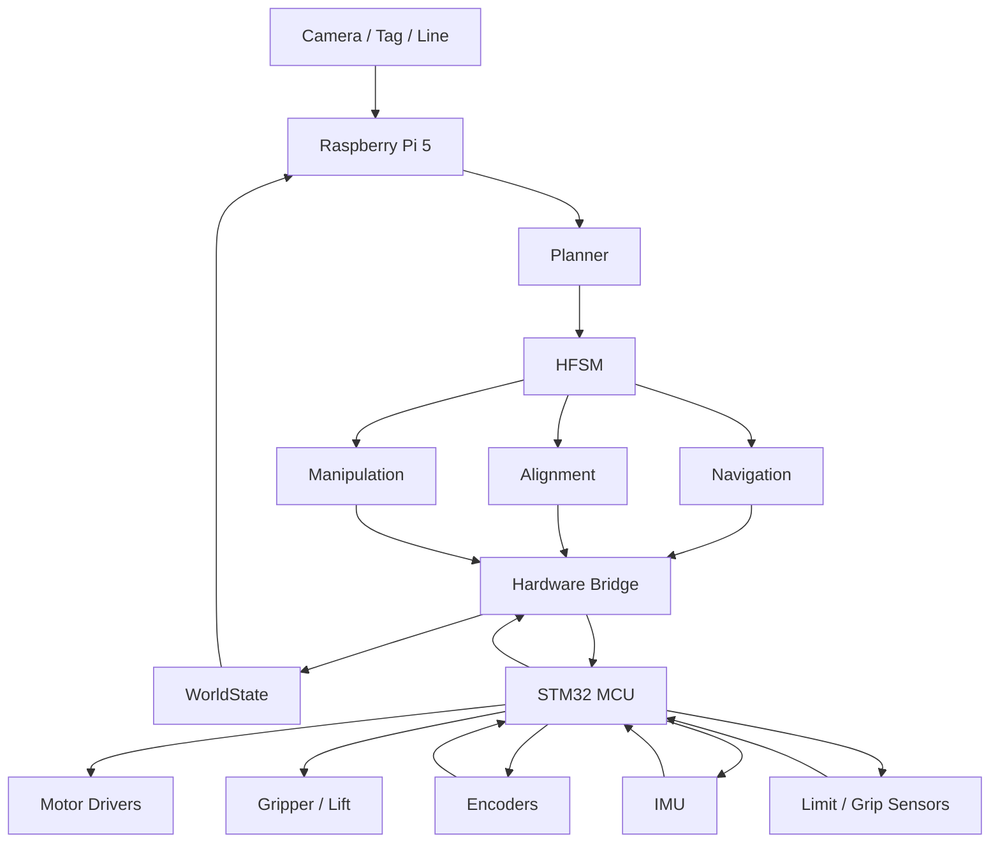
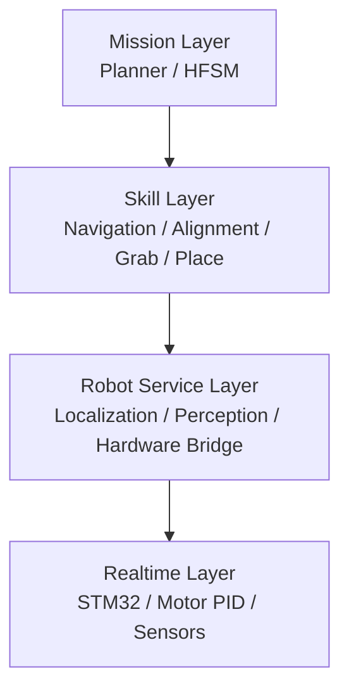
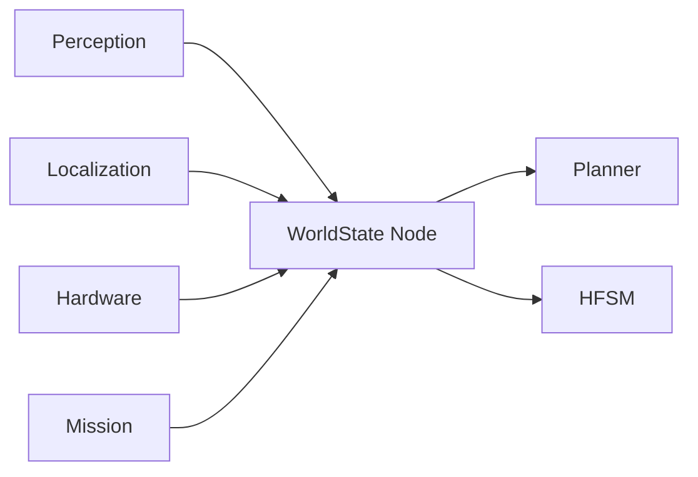
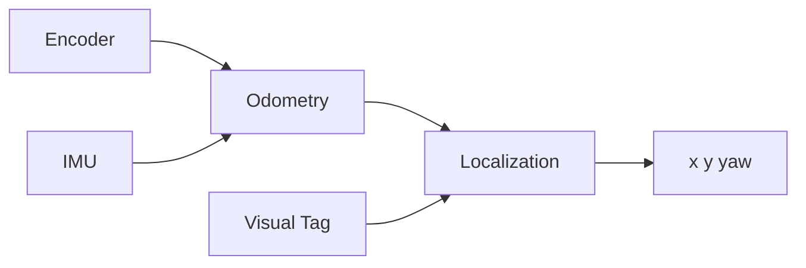
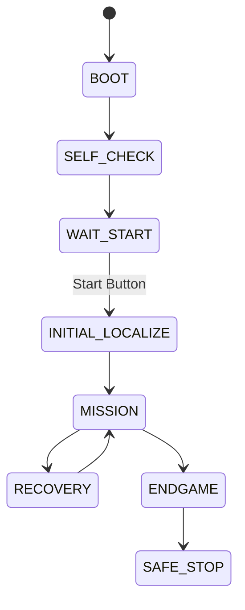

# RoboGame 2026 机器人开发环境与基础软件框架部署指南

> **适用对象**：RoboGame 2026 竞技组机器人  
> **目标**：从一块尚未配置的树莓派和 STM32 开始，搭建一套可以持续开发、整机部署、现场调试和比赛运行的软件基础设施。  
> **核心原则**：高层计算与底层实时控制分离；先搭好稳定框架，再逐模块接入视觉、定位、导航、抓取和搭建算法。

---

## 0. 先明确：MCU 是什么

**MCU = Microcontroller Unit，微控制器单元。**

在本项目中，MCU 指运行底层实时控制程序的单片机，推荐使用 **STM32F4 系列**，例如 STM32F407。

MCU 与树莓派的职责不同：

- **树莓派（SBC / Single-Board Computer，单板计算机）**
  - 运行 Linux
  - 运行 ROS 2
  - 运行视觉、定位、导航、HFSM、Planner 等高层算法
  - 计算量大，但不是硬实时系统

- **STM32（MCU）**
  - 直接连接编码器、IMU、限位开关、电机驱动、舵机等
  - 执行电机 PID、PWM、执行机构控制
  - 响应快、时序确定
  - 负责在树莓派异常时立即停止运动

一句话：

> **树莓派负责“思考”，STM32 负责“把动作稳定地做出来”。**

---

# 1. 项目软件总体目标

现有算法设计已经确定了以下核心逻辑：

```text
感知环境
→ 更新 WorldState
→ Planner 决定下一任务
→ HFSM 调用对应能力
→ 执行
→ 验证
→ 更新状态
→ 重新规划
```

本部署方案的任务，就是把这套逻辑真正落到硬件和代码上。

最终机器人应形成：



---

# 2. 比赛规则对软件架构的直接约束

本项目的软件设计必须从第一天就满足以下约束。

## 2.1 完全自主运行

正式比赛阶段机器人必须全自动运行。

因此：

- 比赛正常运行不能依赖 SSH 命令
- 不能依赖队员在电脑上点击按钮
- 不能远程修改路线
- 不能远程触发抓取
- 无线网络仅用于监控与查看日志

比赛程序必须做到：

```text
上电
→ 系统自动启动
→ 自检
→ 等待物理启动信号
→ 自主完成比赛
```

---

## 2.2 6 分钟比赛时间

软件必须维护：

```text
elapsed_time
remaining_time
```

Planner 根据剩余时间进入：

```text
NORMAL
SAFE
ENDGAME
```

不能把比赛流程写成一个不可中断的长脚本。

---

## 2.3 携带数量限制

WorldState 必须持续维护：

```text
orange_count
purple_count

orange_count + purple_count <= 3
purple_count <= 1
```

任何抓取任务下发之前必须检查该约束。

---

## 2.4 搭建结果必须验证

建筑与机器人脱离接触后稳定至少 3 秒才能有效计分。

因此：

```text
PLACE
→ RETREAT
→ WAIT 3 s
→ VERIFY
→ UPDATE WorldState
```

不能在机械机构一松开以后直接认为“放置成功”。

---

## 2.5 急停

比赛规则要求机器人具有方便操作的急停。

软件急停不能替代硬件急停。

正确设计是：

```text
Battery
   │
   ├── Logic Power ── Raspberry Pi / STM32
   │
   └── Emergency Stop
             │
             └── Actuator Power
                    │
             Motor / Servo / Driver
```

推荐急停直接切断所有执行器功率，使机器人即使在：

- Linux 卡死
- ROS 崩溃
- 串口异常
- MCU 软件异常

时仍然可以物理停止。

---

# 3. 推荐最终硬件计算平台

## 3.1 高层计算平台

推荐：

| 项目 | 推荐 |
|---|---|
| 单板计算机 | Raspberry Pi 5 |
| 内存 | 8 GB |
| 操作系统 | Ubuntu Server 24.04 LTS ARM64 |
| ROS | ROS 2 Jazzy |
| 散热 | Active Cooler / 主动散热 |
| 系统盘 | 64 GB 以上高质量 microSD |
| 后续升级 | NVMe SSD |
| 主视觉 | USB UVC Camera |
| 网络 | Wi-Fi + Ethernet |
| 调试 | SSH |

### 为什么优先 USB UVC Camera

第一版不建议一开始就把大量时间花在相机驱动适配上。

USB UVC 摄像头具有：

- Linux 驱动成熟
- `/dev/video*` 直接识别
- OpenCV 支持简单
- ROS 2 可以直接接入
- 换相机成本低

CSI 相机可以后续根据视场、延迟和体积需求再换。

---

# 4. 底层控制平台

推荐第一版使用：

```text
STM32F407
```

其性能足够承担：

- 4 路或更多底盘电机控制
- 编码器读取
- IMU
- PWM
- UART
- CAN
- ADC
- GPIO
- 定时器
- 执行机构控制

如果后期出现：

- 电机数量明显增加
- 高频传感器很多
- 算法放到 MCU 上运行
- 外设数量不足

再升级 STM32H7。

**第一版不要为了“性能更强”无理由升级 H7。**

---

# 5. 推荐开发技术栈

```text
Mac / Windows 开发电脑
        │
        │ Git + SSH
        ▼
Raspberry Pi 5
Ubuntu Server 24.04 LTS ARM64
        │
        ├── ROS 2 Jazzy
        ├── Python 3
        ├── C++
        ├── OpenCV
        └── Git
        │
        │ UART
        ▼
STM32F407
        │
        ├── C / C++
        ├── STM32 HAL
        ├── Timer
        ├── Encoder
        ├── UART / CAN
        └── PID
```

---

# 6. 为什么选择 Ubuntu 24.04 + ROS 2 Jazzy

截至本文编写时：

- Ubuntu 24.04 LTS 原生支持 Raspberry Pi 5 ARM64。
- ROS 2 Jazzy 官方支持 Ubuntu 24.04 64-bit ARM。
- Jazzy 生命周期长，适合比赛项目持续维护。
- ROS 官方也明确提示：预编译 ROS 2 与系统 Python 要保持兼容，不建议随意混用 Conda Python。

因此固定：

```text
Ubuntu Server 24.04 LTS
+
ROS 2 Jazzy
```

项目开发过程中不要随意升级到其它 Ubuntu / ROS 版本。

---

# 7. 软件分层

整机软件建议严格分为四层。



---

# 8. 各层职责

## 8.1 Mission Layer

负责：

```text
现在该做什么？
任务执行失败后怎么办？
比赛还有多少时间？
应该继续取料还是开始搭建？
```

包括：

- Strategy Planner
- HFSM
- WorldState
- Match Manager
- Recovery

它不直接控制电机。

---

## 8.2 Skill Layer

负责把高层任务变成完整动作。

例如：

```text
NavigateToMaterial
AlignBlock
GrabBlock
NavigateToBuildZone
AlignTower
PlaceBlock
```

每个 Skill 必须统一返回：

```text
RUNNING
SUCCESS
FAILURE
TIMEOUT
```

---

## 8.3 Robot Service Layer

负责：

- 相机图像
- 方块检测
- Tag 检测
- 定位
- 里程计
- 底盘速度接口
- 执行机构接口
- 系统健康状态

---

## 8.4 Realtime Layer

STM32 负责：

```text
Motor PID
Encoder
IMU
PWM
GPIO
Gripper
Lift
Line Sensor
Watchdog
Emergency State
```

---

# 9. ROS 2 工程目录

建议 Git 仓库直接按以下结构建立。

```text
robogame2026/
├── README.md
├── docs/
│   ├── architecture.md
│   ├── protocol.md
│   ├── calibration.md
│   └── test_checklist.md
│
├── ros2_ws/
│   └── src/
│       ├── robogame_interfaces/
│       ├── robogame_bringup/
│       ├── robogame_description/
│       ├── robogame_state/
│       ├── robogame_strategy/
│       ├── robogame_mission/
│       ├── robogame_perception/
│       ├── robogame_localization/
│       ├── robogame_navigation/
│       ├── robogame_alignment/
│       ├── robogame_manipulation/
│       ├── robogame_hardware/
│       ├── robogame_monitor/
│       └── mock/
│
├── firmware/
│   └── stm32/
│
├── config/
│   ├── field.yaml
│   ├── waypoints.yaml
│   ├── camera.yaml
│   ├── localization.yaml
│   ├── navigation.yaml
│   ├── manipulation.yaml
│   ├── strategy.yaml
│   └── hardware.yaml
│
├── scripts/
│   ├── setup_pi.sh
│   ├── build.sh
│   ├── start_robot.sh
│   └── record_bag.sh
│
├── systemd/
│   └── robogame.service
│
└── tests/
```

---

# 10. ROS 包职责

## 10.1 `robogame_interfaces`

只放：

```text
msg/
srv/
action/
```

所有模块共同使用的数据结构统一定义在这里。

不能在此包里写业务逻辑。

---

## 10.2 `robogame_bringup`

负责：

- 整机 launch
- 节点启动顺序
- 参数加载
- competition / test / mock 模式

最终：

```bash
ros2 launch robogame_bringup robot.launch.py mode:=competition
```

即可启动整机。

---

## 10.3 `robogame_description`

负责机器人坐标系定义。

至少建立：

```text
map
└── odom
    └── base_link
        ├── camera_link
        ├── imu_link
        ├── gripper_link
        └── line_sensor_link
```

特别重要的是：

```text
base_link → camera_link
```

相机相对机器人底盘的位置必须标定。

---

## 10.4 `robogame_state`

维护唯一的 WorldState。

其它模块：

> **不能直接修改 WorldState。**

而是发布自己的观测结果：

```text
Localization → pose
Perception   → block detections
Hardware     → actuator state
Mission      → task state
```

WorldState Node 统一融合。

---

## 10.5 `robogame_strategy`

输入：

```text
WorldState
```

输出：

```text
NextTask
```

第一版：

```text
规则策略
+
Utility Score
```

不引入强化学习。

---

## 10.6 `robogame_mission`

实现 HFSM。

顶层：

```text
BOOT
SELF_CHECK
WAIT_START
INITIAL_LOCALIZE
MISSION
RECOVERY
ENDGAME
SAFE_STOP
```

MISSION：

```text
PLAN_NEXT_TASK
ACQUIRE
BUILD
```

---

## 10.7 `robogame_perception`

负责：

```text
Camera
→ preprocessing
→ block detection
→ line / tag detection
```

第一版方块检测：

```text
RGB
→ HSV
→ color threshold
→ morphology
→ contour
→ center / area / angle
```

输出：

```text
orange / purple
pixel center
relative angle
confidence
```

---

## 10.8 `robogame_localization`

第一版融合：

```text
Wheel Encoder
+
IMU
+
Tag correction
```

输出：

```text
x
y
yaw
confidence
```

暂时不做：

- SLAM
- 复杂三维地图

---

## 10.9 `robogame_navigation`

负责远距离运动。

第一版：

```text
Fixed Map
+
Waypoint
+
Line Following
+
PID / Pure Pursuit
```

输入：

```text
goal pose
current pose
```

输出：

```text
/cmd_vel
```

---

## 10.10 `robogame_alignment`

专门负责近距离视觉对准。

原因：

> 导航解决“到附近”，Alignment 解决“最后几厘米”。

流程：

```text
detect target
→ calculate image error
→ generate vx / vy / wz
→ repeat
→ error < threshold
```

---

## 10.11 `robogame_manipulation`

负责：

```text
抓取
放置
升降
夹爪
机械动作验证
```

它不直接产生 PWM。

具体动作由 STM32 完成。

---

## 10.12 `robogame_hardware`

这是 Raspberry Pi 和 STM32 的桥。

负责：

```text
ROS command
→ serial packet
→ STM32
```

以及：

```text
STM32 sensor packet
→ ROS topic
```

---

## 10.13 `robogame_monitor`

负责：

- CPU 温度
- 内存
- ROS 节点状态
- MCU 心跳
- 电池状态
- Camera 状态
- Localization confidence
- 当前 HFSM 状态

只做监控，不控制比赛。

---

## 10.14 `mock`

用于没有整机硬件时开发。

模拟：

```text
fake odometry
fake block
fake gripper
fake manipulator
fake start signal
```

使 Planner / HFSM 可以在机械尚未完成时先跑通。

---

# 11. ROS 接口设计

优先使用 ROS 标准消息。

## 11.1 标准 Topic

```text
/camera/image_raw
/camera/camera_info

/imu/data
/odom
/cmd_vel

/localization/pose
/perception/blocks

/world_state
/diagnostics
```

建议使用：

```text
sensor_msgs/Image
sensor_msgs/Imu
nav_msgs/Odometry
geometry_msgs/Twist
geometry_msgs/PoseStamped
diagnostic_msgs/DiagnosticArray
```

---

# 12. 自定义 Action

耗时动作必须使用 Action。

建议：

```text
NavigateTo.action
AlignTarget.action
GrabBlock.action
PlaceBlock.action
Relocalize.action
```

---

## 12.1 NavigateTo

Goal：

```text
target_pose
timeout
```

Feedback：

```text
distance_remaining
heading_error
```

Result：

```text
success
error_code
message
```

---

## 12.2 GrabBlock

Goal：

```text
block_type
target_id
```

Feedback：

```text
stage
```

例如：

```text
SEARCH
ALIGN
CLOSE
VERIFY
```

Result：

```text
success
reason
```

---

# 13. WorldState 建议结构

```text
WorldState

Robot
├── x
├── y
├── yaw
├── vx
├── vy
├── wz
└── localization_confidence

Match
├── elapsed_time
├── remaining_time
└── phase

Inventory
├── orange_count
└── purple_count

Material
├── orange_available
└── purple_available

Building
├── tower_A
├── tower_B
└── tower_C

Mission
├── current_task
├── current_skill
├── retry_count
└── last_result

System
├── camera_ok
├── mcu_ok
├── localization_ok
├── chassis_ok
├── manipulator_ok
├── battery_ok
└── emergency_stop
```

---

# 14. WorldState 更新原则

绝对不要这样：

```text
Perception 修改 WorldState
Planner 修改 WorldState
Manipulator 修改 WorldState
Localization 修改 WorldState
```

而应：



这样 WorldState 才有唯一数据源。

---

# 15. STM32 固件架构

推荐第一版不要做复杂操作系统。

可以采用：

```text
HAL
+
Timer Interrupt
+
Main Loop
```

如果后期任务明显变复杂，再引入 FreeRTOS。

---

## 15.1 推荐任务频率

参考初值：

| 功能 | 推荐频率 |
|---|---:|
| Motor PID | 500–1000 Hz |
| Encoder Update | 500–1000 Hz |
| IMU Update | 100–500 Hz |
| Chassis Kinematics | 100–200 Hz |
| Line Sensor | 100–500 Hz |
| Host Command | 50–100 Hz |
| Telemetry | 20–100 Hz |
| Heartbeat Check | 50–100 Hz |

这些值需要最终通过实机测量调整。

---

# 16. STM32 模块

```text
BSP
├── uart
├── can
├── gpio
├── timer
├── pwm
├── encoder
└── adc

Drivers
├── motor
├── imu
├── line_sensor
├── gripper
└── lift

Control
├── pid
├── chassis
└── actuator

Communication
├── protocol
├── parser
└── watchdog

Application
├── robot_state
└── safety
```

---

# 17. 树莓派—STM32 通信

## 第一阶段

使用：

```text
UART
```

优点：

- 最容易调试
- 硬件简单
- 延迟低
- 足够完成第一版

## 后期

如果现场出现明显通信干扰，可以迁移：

```text
CAN
```

但接口层保持不变。

---

# 18. 串口协议

不要：

```text
"motor 1 20\n"
```

这种临时文本协议。

建议从第一天使用二进制帧。

```text
SOF
SEQ
MSG_ID
LEN
PAYLOAD
CRC16
```

示意：

```text
0xAA 0x55
SEQ
MSG_ID
LEN_L
LEN_H
PAYLOAD...
CRC_L
CRC_H
```

---

# 19. 推荐消息

Pi → STM32：

```text
CMD_VELOCITY
CMD_GRIPPER
CMD_LIFT
CMD_ACTUATOR
CMD_STOP
HEARTBEAT
```

STM32 → Pi：

```text
ODOMETRY
IMU
LINE_SENSOR
GRIPPER_STATE
LIMIT_STATE
MOTOR_STATE
BATTERY_STATE
FAULT
HEARTBEAT
```

---

# 20. Hardware Bridge

ROS：

```text
/cmd_vel
```

经过：

```text
hardware_bridge_node
```

转换为：

```text
CMD_VELOCITY
vx
vy
wz
```

发送给 STM32。

STM32 返回：

```text
encoder
imu
motor
```

Hardware Bridge 发布：

```text
/odom
/imu/data
/hardware/status
```

---

# 21. Watchdog

必须同时存在两层。

## MCU Watchdog

例如：

```text
Pi 每 50 ms 发 HEARTBEAT
```

如果：

```text
200 ms
```

没有收到有效 Heartbeat：

```text
vx = 0
vy = 0
wz = 0
停止机械执行
```

---

## ROS Watchdog

如果：

- MCU 心跳丢失
- Camera 丢失
- Localization 长时间无输出

则：

```text
MISSION
→ RECOVERY
```

必要时：

```text
→ SAFE_STOP
```

---

# 22. 启动按键

比赛程序正常启动后进入：

```text
WAIT_START
```

推荐使用物理启动按钮。

```text
Start Button
→ STM32 GPIO
→ START_EVENT
→ Raspberry Pi
→ HFSM starts
```

优势：

- 不依赖网络
- 不需要 SSH
- 不属于远程人为控制
- 行为确定

---

# 23. 底盘控制接口

无论最终机械使用：

- 麦克纳姆轮
- 全向轮
- 普通差速
- 其它轮式结构

高层统一接口：

```text
vx
vy
wz
```

导航层永远不直接控制具体电机。

转换关系：

```text
Navigation
→ geometry_msgs/Twist
→ Hardware Bridge
→ STM32 Chassis
→ Wheel Kinematics
→ Motor PID
```

---

# 24. 定位设计

第一版不要上 SLAM。

建议：



---

# 25. 坐标系

统一采用二维场地坐标。

定义：

```text
x：场地长边方向
y：场地短边方向
yaw：机器人朝向
```

所有：

- Waypoint
- Building position
- Material position
- Tag position

都写入：

```text
field.yaml
```

不要散落在 Python 代码中。

---

# 26. 导航

第一版路线：

```text
启动区
→ Waypoint
→ 巡线
→ 材料区附近
```

抓取前切换：

```text
Navigation
→ Visual Alignment
```

放置前同理。

---

# 27. 巡线

推荐优先：

```text
独立红外巡线传感器阵列
→ STM32
```

而不是让主摄像头承担所有巡线工作。

原因：

- 高频
- 延迟低
- 受视觉计算负载影响小
- 适合 5 cm 黑线
- 更容易实时闭环

输出：

```text
line_error
line_confidence
```

STM32 可以直接做低层线误差 PID。

树莓派负责决定：

```text
是否进入 line-follow 模式
```

---

# 28. 视觉

## 第一版视觉任务只有三个

```text
1. 方块颜色识别
2. 近距离中心定位
3. 视觉标签定位
```

不要一开始引入 YOLO。

---

# 29. 方块检测

```text
Camera
→ ROI
→ HSV
→ threshold
→ morphology
→ contour
→ target center
→ confidence
```

建议输出：

```text
type
u
v
area
angle
confidence
timestamp
```

---

# 30. AprilTag / 视觉标签

规则最终给出视觉标签具体位置后，将：

```text
tag_id
tag_x
tag_y
tag_yaw
tag_size
```

全部存入：

```text
field.yaml
```

定位模块根据：

```text
camera pose relative to tag
+
known tag map
```

对里程计进行校正。

---

# 31. 相机标定

视觉可靠运行前必须完成：

## 内参

```text
fx
fy
cx
cy
distortion
```

保存：

```text
camera.yaml
```

## 外参

测量：

```text
base_link → camera_link
```

包括：

```text
x
y
z
roll
pitch
yaw
```

---

# 32. Visual Servo

最终几厘米不能依赖全局定位。

输入：

```text
target pixel center
```

计算：

```text
error_x
error_y
angle_error
```

控制：

```text
vx
vy
wz
```

直到：

```text
abs(error) < threshold
```

然后执行抓取/放置。

---

# 33. 抓取

完整抓取必须是：

```text
SEARCH
→ ALIGN
→ APPROACH
→ CLOSE
→ LIFT
→ VERIFY
```

不能：

```text
CLOSE
→ success
```

---

# 34. 抓取验证

建议至少有一个物理传感器：

- 光电
- 限位
- 夹爪编码器
- 电流
- 距离传感器

输出：

```text
grip_detected = true / false
```

视觉可以辅助验证，但不应是唯一依据。

---

# 35. 搭建

第一版固定三座塔：

```text
Tower A
Tower B
Tower C
```

每座塔在：

```text
field.yaml
```

中定义固定中心。

例如：

```yaml
towers:
  A:
    x: 0.80
    y: 1.20
  B:
    x: 1.20
    y: 1.20
  C:
    x: 1.60
    y: 1.20
```

实际坐标必须实地标定后填写。

---

# 36. 放置动作

```text
NAV_TO_BUILD
→ ALIGN_TOWER
→ SET_HEIGHT
→ PLACE
→ RELEASE
→ RETREAT
→ WAIT_3S
→ VERIFY
```

---

# 37. Planner

第一版使用：

```text
Utility = ExpectedScore - TimeCost - RiskCost
```

主要候选任务：

```text
ACQUIRE_ORANGE
ACQUIRE_PURPLE
BUILD_A
BUILD_B
BUILD_C
ENDGAME
```

禁止直接上 RL / LLM / MCTS。

---

# 38. HFSM

建议 Python Enum + Class 实现。

不要在第一版引入大型行为树框架。

顶层：

```text
BOOT
SELF_CHECK
WAIT_START
INITIAL_LOCALIZE
MISSION
RECOVERY
ENDGAME
SAFE_STOP
```

每个状态必须：

```text
有进入条件
有退出条件
有超时
有失败出口
```

---

# 39. Recovery

统一分三级。

## Level 1

```text
局部重试
```

例如：

```text
grab failed
→ back
→ detect
→ align
→ grab
```

## Level 2

```text
放弃当前目标
→ Planner 重新规划
```

## Level 3

```text
停车
→ tag relocalization
→ 恢复定位
```

失败：

```text
SAFE_STOP
```

---

# 40. 配置文件

所有可调参数必须集中。

```text
config/
```

例如：

## `navigation.yaml`

```yaml
max_vx: 0.6
max_vy: 0.6
max_wz: 1.5

goal_tolerance_xy: 0.03
goal_tolerance_yaw: 0.05
```

以上仅为结构示例，不是最终实机参数。

---

## `strategy.yaml`

```yaml
normal_end_time: 240.0
safe_end_time: 320.0
match_end_time: 360.0

max_inventory: 3
max_purple_inventory: 1
```

---

# 41. 不允许写死的东西

以下内容禁止散落到代码：

```text
场地尺寸
Waypoint
Tag 坐标
相机参数
PID
速度上限
抓取高度
塔位置
HSV threshold
比赛时间阈值
```

统一 YAML。

---

# 42. Mac 开发环境

Mac 只作为开发终端。

安装：

- Git
- VSCode / Cursor
- Remote SSH
- Raspberry Pi Imager

推荐开发模式：

```text
Mac
→ Remote SSH
→ Raspberry Pi
→ edit
→ build
→ test
```

这样实际运行和编译始终发生在 Linux ARM64。

---

# 43. 创建 SSH Key

Mac：

```bash
ssh-keygen -t ed25519
```

查看：

```bash
cat ~/.ssh/id_ed25519.pub
```

烧录系统时将公钥加入 Raspberry Pi。

---

# 44. 烧录 Raspberry Pi

使用 Raspberry Pi Imager。

选择：

```text
Device:
Raspberry Pi 5

OS:
Ubuntu Server 24.04 LTS 64-bit

Storage:
microSD
```

建议预设：

```text
hostname: robogame-pi
username: robot
timezone: Asia/Shanghai
SSH: enabled
authentication: public key
```

---

# 45. Raspberry Pi 首次启动

SSH：

```bash
ssh robot@robogame-pi.local
```

如果 mDNS 不可用，则从路由器查 IP：

```bash
ssh robot@<IP>
```

---

# 46. 系统更新

```bash
sudo apt update
sudo apt full-upgrade -y
sudo reboot
```

重新连接。

---

# 47. 安装基础工具

```bash
sudo apt update

sudo apt install -y \
  git \
  curl \
  wget \
  vim \
  htop \
  tmux \
  build-essential \
  cmake \
  ninja-build \
  pkg-config \
  python3 \
  python3-pip \
  python3-venv \
  python3-dev \
  python3-opencv \
  libopencv-dev \
  v4l-utils \
  i2c-tools \
  can-utils \
  minicom
```

---

# 48. 用户权限

串口：

```bash
sudo usermod -aG dialout $USER
```

摄像头：

```bash
sudo usermod -aG video $USER
```

之后：

```bash
sudo reboot
```

---

# 49. 检查平台

```bash
uname -a
```

确认 ARM64：

```bash
dpkg --print-architecture
```

预期：

```text
arm64
```

检查 Python：

```bash
python3 --version
```

检查 OpenCV：

```bash
python3 -c "import cv2; print(cv2.__version__)"
```

---

# 50. 安装 ROS 2 Jazzy

以下按照 ROS 2 官方 Ubuntu 安装方式配置 apt 源。

## 50.1 Locale

```bash
sudo apt update
sudo apt install -y locales
sudo locale-gen en_US en_US.UTF-8
sudo update-locale LC_ALL=en_US.UTF-8 LANG=en_US.UTF-8
export LANG=en_US.UTF-8
```

---

## 50.2 Universe

```bash
sudo apt install -y software-properties-common
sudo add-apt-repository universe
```

---

## 50.3 ROS apt source

```bash
sudo apt update
sudo apt install -y curl
```

```bash
export ROS_APT_SOURCE_VERSION=$(
  curl -s https://api.github.com/repos/ros-infrastructure/ros-apt-source/releases/latest \
  | grep -F "tag_name" \
  | awk -F'"' '{print $4}'
)
```

```bash
curl -L -o /tmp/ros2-apt-source.deb \
"https://github.com/ros-infrastructure/ros-apt-source/releases/download/${ROS_APT_SOURCE_VERSION}/ros2-apt-source_${ROS_APT_SOURCE_VERSION}.$(. /etc/os-release && echo ${UBUNTU_CODENAME:-${VERSION_CODENAME}})_all.deb"
```

```bash
sudo dpkg -i /tmp/ros2-apt-source.deb
sudo apt update
```

---

# 51. 安装 ROS Base

机器人端：

```bash
sudo apt install -y \
  ros-jazzy-ros-base \
  ros-dev-tools
```

建议树莓派不安装完整 Desktop。

---

# 52. ROS 环境

```bash
echo "source /opt/ros/jazzy/setup.bash" >> ~/.bashrc
source ~/.bashrc
```

测试：

```bash
ros2 --help
```

---

# 53. rosdep

```bash
sudo rosdep init
```

如果提示已经初始化，可以忽略。

然后：

```bash
rosdep update
```

---

# 54. 常用 ROS 依赖

根据实际代码按需安装。

基础：

```bash
sudo apt install -y \
  ros-jazzy-cv-bridge \
  ros-jazzy-image-transport \
  ros-jazzy-tf2 \
  ros-jazzy-tf2-ros \
  ros-jazzy-rqt \
  ros-jazzy-rqt-common-plugins
```

摄像头驱动最终根据实际相机确定。

---

# 55. Python 环境原则

不要安装 Conda。

优先级：

```text
apt
→ rosdep
→ system Python
→ 必要时 venv
```

因为 ROS 2 预编译包依赖系统 Python ABI。

---

# 56. 创建仓库

```bash
mkdir -p ~/robogame2026/ros2_ws/src
cd ~/robogame2026
git init
```

---

# 57. 创建 ROS 包

示例：

```bash
cd ~/robogame2026/ros2_ws/src
```

Python：

```bash
ros2 pkg create \
  --build-type ament_python \
  robogame_state
```

C++：

```bash
ros2 pkg create \
  --build-type ament_cmake \
  robogame_hardware
```

不要一次写完所有模块。

先把目录建立，再逐个实现。

---

# 58. 第一批必须建立的包

第一周只建立：

```text
robogame_interfaces
robogame_bringup
robogame_state
robogame_mission
robogame_hardware
mock
```

此时先不写复杂视觉。

---

# 59. 编译

```bash
cd ~/robogame2026/ros2_ws
```

安装依赖：

```bash
rosdep install \
  --from-paths src \
  --ignore-src \
  -r -y
```

编译：

```bash
colcon build --symlink-install
```

环境：

```bash
source install/setup.bash
```

建议加入：

```bash
echo "source ~/robogame2026/ros2_ws/install/setup.bash" >> ~/.bashrc
```

---

# 60. Mock 模式

没有整车时首先完成：

```bash
ros2 launch robogame_bringup robot.launch.py mode:=mock
```

模拟：

```text
Fake MCU
Fake Odom
Fake Manipulator
Fake Camera Events
```

要求 HFSM 能完整走：

```text
BOOT
→ SELF_CHECK
→ WAIT_START
→ INITIAL_LOCALIZE
→ PLAN
→ ACQUIRE
→ BUILD
→ ENDGAME
```

---

# 61. STM32 开发环境

推荐：

```text
STM32CubeMX
+
STM32CubeIDE
```

或：

```text
CubeMX
+
VSCode / CMake
```

第一版优先保证团队能稳定编译和烧录，不需要追求高级构建系统。

---

# 62. STM32 第一阶段只做五件事

```text
1. UART 通信
2. Encoder
3. Motor PWM
4. Motor PID
5. Heartbeat Safety
```

先不要把：

```text
机械臂
视觉
复杂逻辑
```

一起塞进去。

---

# 63. Pi ↔ STM32 第一次联调

先不接电机。

流程：

```text
Pi
→ HEARTBEAT
→ STM32
→ ACK
→ Pi
```

然后：

```text
Pi:
CMD_VELOCITY 0.1 0 0

STM32:
解析成功
打印/回传速度目标
```

确认协议稳定以后再接电机。

---

# 64. 底盘第一次联调

按顺序：

```text
单电机
→ 单电机 Encoder
→ 单电机 PID
→ 四电机
→ 底盘正向
→ 横向
→ 旋转
→ Twist 控制
```

不要直接测试完整导航。

---

# 65. ROS 底盘链路验收

必须做到：

```bash
ros2 topic pub /cmd_vel geometry_msgs/msg/Twist ...
```

机器人能：

```text
稳定运动
→ 停止
→ 速度反馈
→ odom 输出
```

并且停止发送 `/cmd_vel` 后 MCU 自动停机。

---

# 66. 相机验收

插入相机：

```bash
v4l2-ctl --list-devices
```

查看：

```bash
ls /dev/video*
```

测试：

```bash
python3 - <<'PY'
import cv2

cap = cv2.VideoCapture(0)
ok, frame = cap.read()

print("camera:", ok)
if ok:
    print(frame.shape)

cap.release()
PY
```

必须先证明 Linux 层相机可靠，再写识别算法。

---

# 67. ROS 图像链路

最终应做到：

```text
Camera Driver
→ /camera/image_raw
→ Perception
→ /perception/blocks
```

Perception 不直接控制底盘。

---

# 68. 日志

所有模块使用统一日志。

至少输出：

```text
timestamp
node
state
task
result
error
```

例如：

```text
[125.23] mission ACQUIRE ALIGN SUCCESS
[126.01] manipulation GRAB FAILURE no_object
```

---

# 69. rosbag

关键调试必须记录：

```text
/camera/image_raw
/odom
/imu/data
/localization/pose
/perception/blocks
/world_state
/cmd_vel
/diagnostics
```

建议建立脚本：

```bash
scripts/record_bag.sh
```

---

# 70. 系统监控

比赛时至少监测：

```text
CPU temperature
CPU load
RAM
disk
camera fps
MCU heartbeat
ROS node health
battery
localization confidence
```

---

# 71. 运行模式

统一定义三种模式。

## `mock`

无硬件。

## `test`

实机调试，可单独启动模块。

## `competition`

完整比赛配置。

任何测试参数禁止混入 competition。

---

# 72. 自动启动

比赛不能依赖 SSH。

建立：

```text
systemd/robogame.service
```

示例：

```ini
[Unit]
Description=RoboGame Robot
After=network.target

[Service]
Type=simple
User=robot
WorkingDirectory=/home/robot/robogame2026
ExecStart=/home/robot/robogame2026/scripts/start_robot.sh
Restart=on-failure
RestartSec=2

[Install]
WantedBy=multi-user.target
```

---

# 73. `start_robot.sh`

```bash
#!/usr/bin/env bash
set -e

source /opt/ros/jazzy/setup.bash
source /home/robot/robogame2026/ros2_ws/install/setup.bash

exec ros2 launch \
  robogame_bringup \
  robot.launch.py \
  mode:=competition
```

权限：

```bash
chmod +x scripts/start_robot.sh
```

---

# 74. 启用服务

复制：

```bash
sudo cp systemd/robogame.service /etc/systemd/system/
```

刷新：

```bash
sudo systemctl daemon-reload
```

启用：

```bash
sudo systemctl enable robogame.service
```

启动：

```bash
sudo systemctl start robogame.service
```

状态：

```bash
systemctl status robogame.service
```

日志：

```bash
journalctl -u robogame.service -f
```

---

# 75. 软件启动顺序

推荐：

```text
1. hardware_bridge
2. sensor drivers
3. camera
4. localization
5. perception
6. WorldState
7. navigation
8. alignment
9. manipulation
10. strategy
11. mission
12. monitor
```

Mission 不应在传感器尚未 ready 时开始执行。

---

# 76. SELF_CHECK

机器人启动后首先检查：

```text
MCU heartbeat
Camera
Encoder
IMU
Manipulator
Battery
E-stop
Localization
```

只有：

```text
critical components == READY
```

才能：

```text
SELF_CHECK
→ WAIT_START
```

---

# 77. 比赛启动逻辑

完整流程：



---

# 78. 比赛软件禁止依赖网络

即使：

```text
Wi-Fi 断开
```

机器人也必须继续比赛。

因此：

```text
Git
SSH
Dashboard
Remote Log
```

都不是实时控制路径的一部分。

---

# 79. Git 工作流

推荐主分支：

```text
main
develop
```

功能分支：

```text
feature/perception
feature/navigation
feature/stm32
feature/manipulation
```

禁止多人直接在同一个文件里无版本管理修改。

---

# 80. 每次可运行版本打 Tag

例如：

```bash
git tag v0.1-chassis
git tag v0.2-navigation
git tag v0.3-grab
git tag v0.4-full-loop
```

比赛前：

```text
v1.0-competition
```

---

# 81. 比赛前冻结环境

稳定版本完成以后：

- 不临时升级 Ubuntu
- 不临时升级 ROS
- 不随意 `pip install -U`
- 不更换 Python
- 不更换串口协议
- 不临时大改 PID

保留：

```text
git commit
config
system version
package list
firmware binary
```

---

# 82. 备份

比赛前至少保存：

```text
Git repository
STM32 firmware .bin
Pi config
ROS config
systemd service
camera calibration
PID
waypoints
```

推荐一张备用系统盘。

---

# 83. 第一阶段验收目标

## A. 树莓派

- [ ] Ubuntu 24.04 正常启动
- [ ] SSH 正常
- [ ] Git 正常
- [ ] ROS 2 Jazzy 正常
- [ ] OpenCV 正常
- [ ] Camera 正常
- [ ] systemd 自动启动正常

## B. STM32

- [ ] 固件可重复烧录
- [ ] UART 正常
- [ ] Encoder 正常
- [ ] PWM 正常
- [ ] Motor PID 正常
- [ ] Watchdog 正常

## C. 通信

- [ ] Pi → MCU command
- [ ] MCU → Pi telemetry
- [ ] CRC 正常
- [ ] 丢包不会失控
- [ ] Pi 断线 MCU 自动停车

---

# 84. 第二阶段验收目标

- [ ] `/cmd_vel` 可控制底盘
- [ ] `/odom` 正确
- [ ] IMU 正确
- [ ] 巡线可独立运行
- [ ] Waypoint 可到达
- [ ] 机器人连续运动 10 分钟不重启
- [ ] 电机启动不会导致 Pi 掉电

---

# 85. 第三阶段验收目标

- [ ] 稳定识别橙色方块
- [ ] 稳定识别紫色方块
- [ ] 相机标定完成
- [ ] Visual Servo 完成
- [ ] Tag 定位校正完成
- [ ] 抓取结果可验证

---

# 86. 第四阶段验收目标

机器人可连续执行：

```text
启动
→ 导航
→ 找方块
→ 对准
→ 抓取
→ 验证
→ 运输
→ 对准搭建区
→ 放置
→ 后退
→ 等待 3 秒
→ 验证
→ 再规划
```

连续至少：

```text
10 次
```

记录成功率。

---

# 87. 测试必须统计数据

不要使用：

```text
“感觉挺稳”
```

应统计：

| 测试 | 指标 |
|---|---|
| 导航 | 终点位置误差 |
| 转向 | yaw 误差 |
| 方块检测 | 成功率 |
| Visual Servo | 对准误差 |
| 抓取 | 成功率 |
| 放置 | 成功率 |
| 建筑 | 3 s 稳定率 |
| 单循环 | 平均耗时 |
| 整场 | 总分 / 完成率 |

Planner 最终的时间阈值和风险参数必须由这些数据确定。

---

# 88. 推荐实际开发顺序

```text
Phase 0
环境与框架

Phase 1
Pi ↔ STM32

Phase 2
底盘闭环

Phase 3
Odometry + IMU

Phase 4
Waypoint + 巡线

Phase 5
Camera + Block Detection

Phase 6
Visual Servo

Phase 7
Grab / Place

Phase 8
WorldState + HFSM

Phase 9
Planner + Recovery

Phase 10
整场比赛
```

---

# 89. 第一周最实际的任务

不要马上做完整 RoboGame。

第一周目标只需要达到：

```text
Mac
  │
SSH
  ▼
Pi
  │
ROS 2
  │
Hardware Bridge
  │
UART
  ▼
STM32
  │
Motor PID
  ▼
底盘
```

并且：

```text
ros2 topic pub /cmd_vel
```

能让机器人稳定移动。

这意味着底层基础设施已经真正建立起来。

---

# 90. 第二周目标

建立：

```text
WorldState
HFSM
Mock
```

即使视觉还没有完成，也能够：

```text
BOOT
→ SELF_CHECK
→ WAIT_START
→ NAV
→ FAKE_GRAB
→ NAV
→ FAKE_PLACE
→ REPLAN
```

先跑通完整软件闭环。

---

# 91. 第三阶段之后

再逐步把：

```text
FAKE_GRAB
```

替换成：

```text
Perception
+
Visual Servo
+
Manipulator
```

把：

```text
FAKE_ODOM
```

替换成：

```text
Encoder
+
IMU
+
Tag
```

整个顶层框架不用重写。

---

# 92. 最终系统的评价标准

一个比赛机器人软件系统是否设计成功，不应该看：

```text
算法是否复杂
代码是否很多
用了多少 AI
```

而应看：

```text
能不能自己启动
能不能知道自己在哪
能不能知道下一步做什么
能不能稳定执行
失败后能不能恢复
断网还能不能比赛
一个模块坏了会不会整车失控
能不能复现问题
能不能快速调参数
能不能连续跑完整 6 分钟
```

---

# 93. 本项目最终推荐栈

| 层级 | 方案 |
|---|---|
| SBC | Raspberry Pi 5 8GB |
| OS | Ubuntu Server 24.04 LTS ARM64 |
| Middleware | ROS 2 Jazzy |
| High-level | Python 3 |
| Performance module | C++ |
| Vision | OpenCV |
| Camera | USB UVC first |
| Mission | Python HFSM |
| Strategy | Rule + Utility |
| State | Central WorldState Node |
| Localization | Encoder + IMU + Tag |
| Navigation | Waypoint + Line + PID/Pure Pursuit |
| Alignment | Visual Servo |
| MCU | STM32F407 |
| MCU firmware | HAL + timer loop |
| Pi–MCU | UART first, CAN optional later |
| Motor | PID on STM32 |
| Config | YAML |
| Deployment | ROS launch + systemd |
| Logging | ROS log + rosbag |
| Development | Mac + SSH |
| Version control | Git |
| Safety | Hardware E-stop + MCU Watchdog |

---

# 94. 当前明确不做

第一版暂时不引入：

```text
SLAM
Nav2
YOLO
强化学习
大模型
VLM
MCTS
端到端控制
复杂行为树框架
Docker 化整机实时控制
Conda
```

这些并不是永远不能用，而是当前收益不足以抵消工程复杂度。

---

# 95. 下一步工作清单

立即执行：

1. 准备 Raspberry Pi 5、系统盘和主动散热。
2. 烧录 Ubuntu Server 24.04 LTS ARM64。
3. 配好 SSH。
4. 安装 Git、OpenCV、ROS 2 Jazzy。
5. 建立 `robogame2026` Git 仓库。
6. 建立 ROS workspace。
7. 创建 `interfaces / bringup / state / mission / hardware / mock` 六个基础包。
8. STM32 完成 UART + Encoder + Motor PID + Watchdog。
9. 打通 Pi ↔ STM32。
10. 打通 `/cmd_vel → STM32 → Motor`。
11. 打通 `Encoder → STM32 → /odom`。
12. 建立 Mock HFSM 完整比赛闭环。
13. 再开始接入视觉、定位、抓取与搭建。

---

# 96. 参考资料

## 项目内部依据

- `RoboGame2026_algo.md`
- `RoboGame2026 竞技组规则手册`
- `RG2026计划书介绍.pptx`

## 官方技术资料

- Ubuntu Raspberry Pi：
  https://ubuntu.com/download/raspberry-pi

- Ubuntu Raspberry Pi 安装：
  https://ubuntu.com/hardware/docs/boards/tutorials/raspberry-pi-other/

- Raspberry Pi Getting Started：
  https://www.raspberrypi.com/documentation/computers/getting-started.html

- ROS 2 Jazzy：
  https://docs.ros.org/en/jazzy/

- ROS 2 Jazzy Ubuntu 安装：
  https://docs.ros.org/en/jazzy/Installation.html

- ROS 2 Python Package 说明：
  https://docs.ros.org/en/jazzy/How-To-Guides/Using-Python-Packages.html

---

# 97. 一句话总结

最终系统应当形成：

```text
Raspberry Pi
负责：
看、想、规划、调度、记录

STM32 MCU
负责：
读取传感器、控制电机、执行动作、保证实时性和安全

二者通过稳定通信连接
```

开发过程中始终遵循：

> **先打通硬件与软件基础闭环，再逐步增加算法复杂度；任何高级模块都不能破坏整机稳定性。**
